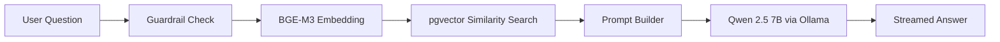

# Port Land Lease RAG AI Assistant — Full Project Overview

## What Is This?

This is a **Retrieval-Augmented Generation (RAG) chatbot** built for a **Port Land Management System (PMS)**. It allows users to ask questions about port-related documents (board notes, land lease agreements, etc.) and get AI-generated answers grounded in the actual document content — not hallucinated.



---

## Tech Stack

| Layer | Technology | Purpose |
|---|---|---|
| **Frontend** | Vanilla HTML/CSS/JS | Chat UI served as static files |
| **API Server** | FastAPI + Uvicorn | REST & SSE streaming endpoints |
| **Embedding Model** | `BAAI/bge-m3` (FlagEmbedding) | Converts text → 1024-dim dense vectors |
| **Vector Database** | PostgreSQL + `pgvector` | Stores & searches embeddings via cosine distance |
| **LLM** | `qwen2.5:7b` via Ollama (local) | Generates answers from retrieved context |
| **OCR Engine** | PaddleOCR | Extracts text from scanned PDF images |
| **PDF Rendering** | PyMuPDF (fitz) | Converts PDF pages → high-res PNGs for OCR |
| **Image Processing** | OpenCV + NumPy | Pre-processes scanned images (denoise, sharpen, contrast) |
| **Safety** | `better-profanity` + custom regex | Input guardrails blocking vulgar/profane queries |

---

## Directory Structure

```
RAG_SYSTEM/
├── app/
│   ├── api_server.py              ← FastAPI server (the main entry point you run)
│   ├── services/                  ← All backend service modules
│   │   ├── embedding_service.py   ← BGE-M3 embedding (text → vector)
│   │   ├── postgres_service.py    ← pgvector DB: save & search chunks
│   │   ├── llm_service.py         ← Ollama Qwen2.5 inference
│   │   ├── prompt_builder.py      ← Constructs the RAG prompt
│   │   ├── guardrail_service.py   ← Profanity / abuse filter
│   │   ├── chat_history_service.py← Persists chat sessions to JSON
│   │   ├── pdf_renderer.py        ← PDF → PNG page images
│   │   ├── ocr_service.py         ← PaddleOCR wrapper
│   │   ├── ocr_parser.py          ← Normalizes OCR output
│   │   ├── image_preprocessor.py  ← Grayscale, denoise, sharpen
│   │   ├── document_builder.py    ← Builds canonical document dict
│   │   ├── metadata_extractor.py  ← Title, hash, word count, etc.
│   │   ├── chunk_service.py       ← Sliding-window text chunking
│   │   └── chunk_validator.py     ← Filters empty/tiny/duplicate chunks
│   └── static/
│       ├── index.html             ← Chat UI
│       ├── app.js                 ← Frontend logic (SSE streaming, sessions)
│       └── styles.css             ← Styling
│
├── scripts/
│   ├── rag_system_embedding.py    ← 🔑 Production ingestion pipeline (scanned PDFs)
│   ├── rag_system_embedding_textual.py ← Ingestion for text-based PDFs
│   ├── rag_system_chatbot.py      ← CLI chatbot (no web UI)
│   ├── curate_documents.py        ← Document curation utility
│   ├── ingest_all_pdfs.py         ← Batch PDF ingestion helper
│   ├── inspect_document.py        ← Debug: inspect a parsed document
│   └── tests/                     ← 16 unit/integration test scripts
│
├── data/
│   ├── chat_sessions.json         ← Persisted chat history
│   └── uploads/                   ← User-uploaded documents
│
├── .env                           ← PostgreSQL connection config
└── requirements.txt               ← Python dependencies
```

---

## The Two Main Workflows

### 1. Document Ingestion Pipeline (`scripts/rag_system_embedding.py`)

This is the **offline** pipeline you run to index documents into the vector database. It processes scanned PDFs through a 9-step pipeline:

| Step | Service | What It Does |
|------|---------|--------------|
| 1 | `PDFRenderer` | Renders each PDF page to a 300 DPI PNG image |
| 2 | `OCRService` + `OCRParser` | Runs PaddleOCR on each image, normalizes output |
| 3 | `CanonicalDocumentBuilder` | Assembles a unified document dictionary |
| 4 | `MetadataExtractor` | Extracts title, hash, word/char counts, file size |
| 5 | `ChunkService` | Splits text into 250-word chunks with 40-word overlap |
| 6 | `ChunkValidator` | Filters out empty, too-small, too-large, or duplicate chunks |
| 7 | `EmbeddingService` | Embeds each chunk using BGE-M3 (1024-dim dense vectors) |
| 8 | `PostgreSQLService` | Saves the document record to `documents` table |
| 9 | `PostgreSQLService` | Saves all embedded chunks to `chunks` table (with `tsvector`) |

### 2. Chat / Query Pipeline (`app/api_server.py`)

This is the **online** pipeline serving user questions via the web UI:

| Step | Service | What It Does |
|------|---------|--------------|
| 0 | `GuardrailService` | Blocks profane/abusive input before any processing |
| 1 | `EmbeddingService` | Embeds the user's question into a 1024-dim vector |
| 2 | `PostgreSQLService` | Searches pgvector for top-K most similar chunks (cosine distance `<=>`) |
| 3 | `PromptBuilder` | Constructs a grounded prompt: system instruction + retrieved context + question |
| 4 | `LLMService` | Streams tokens from Qwen 2.5 7B (via Ollama) back to the client via SSE |

---

## API Endpoints

| Method | Endpoint | Purpose |
|--------|----------|---------|
| `GET` | `/` | Serves the frontend `index.html` |
| `GET` | `/api/health` | Health check (shows if RAG services are loaded) |
| `POST` | `/api/chat` | Non-streaming chat (returns full JSON response) |
| `POST` | `/api/chat/stream` | **Streaming chat** via Server-Sent Events (SSE) |
| `POST` | `/api/upload` | Upload a PDF document for future indexing |
| `GET` | `/api/sessions` | Retrieve saved chat sessions |
| `POST` | `/api/sessions` | Save chat sessions |
| `DELETE` | `/api/sessions/{id}` | Delete a specific chat session |

---

## Key Services Explained

### [embedding_service.py](file:///d:/AI-PMS/RAG/RAG_SYSTEM/app/services/embedding_service.py)
Loads the **BGE-M3** model (via FlagEmbedding, with HuggingFace transformers fallback). Provides `embed_text()` for single queries and `embed_chunks()` for batch ingestion. Outputs 1024-dimensional dense vectors.

### [postgres_service.py](file:///d:/AI-PMS/RAG/RAG_SYSTEM/app/services/postgres_service.py)
Connects to PostgreSQL (`pms` database, `pms_vector` schema) using `psycopg`. Stores documents and chunks with their embeddings. Uses the **pgvector** `<=>` (cosine distance) operator for similarity search.

### [llm_service.py](file:///d:/AI-PMS/RAG/RAG_SYSTEM/app/services/llm_service.py)
Wraps **Ollama** to call `qwen2.5:7b` locally. Supports both `generate()` (full response) and `generate_stream()` (token-by-token yielding for SSE).

### [guardrail_service.py](file:///d:/AI-PMS/RAG/RAG_SYSTEM/app/services/guardrail_service.py)
Combines `better-profanity` with custom regex patterns to catch obfuscated vulgar input (leetspeak, etc.). Whitelists domain terms like "PMS" so they aren't falsely flagged.

### [chunk_service.py](file:///d:/AI-PMS/RAG/RAG_SYSTEM/app/services/chunk_service.py)
Sliding-window chunker: **250 words per chunk, 40-word overlap**. Each chunk carries parent text (full page), child text (the chunk), metadata, and document lineage.

### [document_builder.py](file:///d:/AI-PMS/RAG/RAG_SYSTEM/app/services/document_builder.py)
Two modes: `build()` for OCR-parsed scanned PDFs, and `build_from_text_pdf()` for text-based PDFs (direct PyMuPDF text extraction — no OCR needed).

---

## External Dependencies Required

> [!IMPORTANT]
> The system requires these **external services** to be running:
> 1. **PostgreSQL** with the `pgvector` extension enabled (database: `pms`, schema: `pms_vector`)
> 2. **Ollama** with the `qwen2.5:7b` model pulled (`ollama pull qwen2.5:7b`)

---

## Test Coverage

The project includes **16 test scripts** under `scripts/tests/` covering every service individually:

| Test | Validates |
|------|-----------|
| `test_renderer.py` | PDF → PNG rendering |
| `test_ocr.py` / `test_paddle_ocr.py` | OCR text extraction |
| `test_parser.py` | OCR output parsing |
| `test_document_builder.py` | Canonical document construction |
| `test_metadata_extractor.py` | Metadata extraction |
| `test_chunk_service.py` | Text chunking |
| `test_chunk_validator.py` | Chunk quality filtering |
| `test_embedding.py` / `test_embedding_pipeline.py` | Embedding generation |
| `test_postgres.py` / `test_postgres_service.py` | Database operations |
| `test_prompt_builder.py` | Prompt construction |
| `test_retrieval.py` | End-to-end retrieval |
| `test_llm.py` | LLM inference |
| `test_preprocessor.py` | Image preprocessing |
| `test_save_document.py` | Document persistence |
